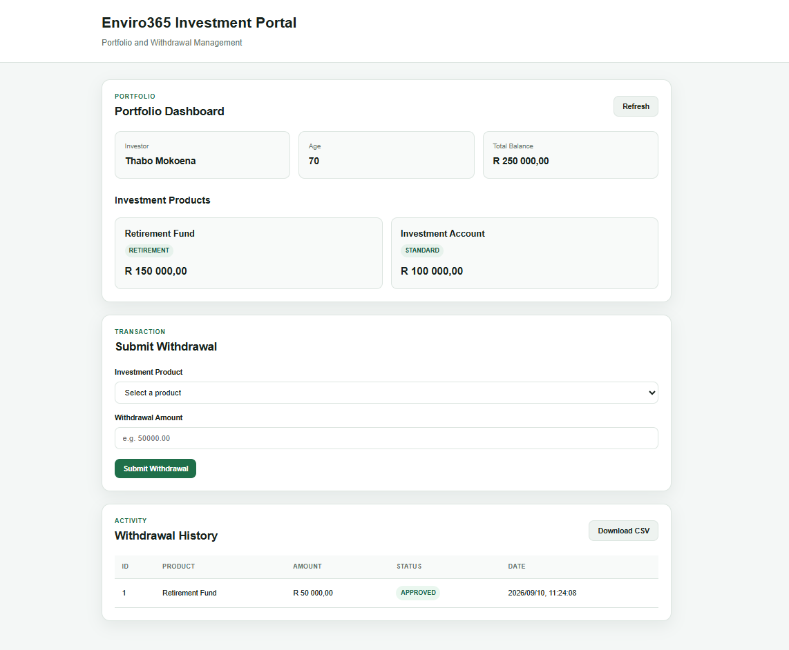
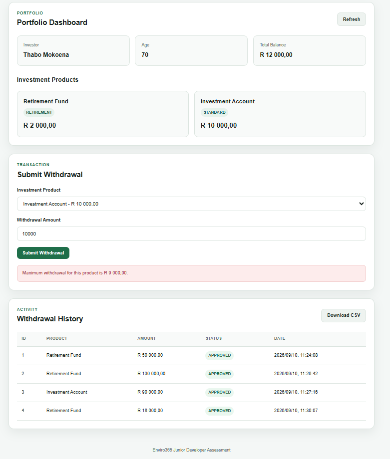

# Enviro365 Investment Withdrawal Management System

A full-stack investment portfolio and withdrawal management application developed for the Enviro365 Junior Software Developer technical assessment.

The system allows an investor to:

- View portfolio information and investment products
- Submit withdrawal requests
- Apply withdrawal eligibility and balance rules
- View withdrawal history
- Export withdrawal records as CSV
- Receive clear validation and error feedback

---

## Technology Stack

### Backend

- Java 17
- Spring Boot 4.1.1
- Spring Web MVC
- Spring Data JPA
- Jakarta Bean Validation
- H2 Database
- Maven

### Frontend

- HTML5
- CSS3
- Vanilla JavaScript
- Fetch API

### Testing and Development

- JUnit 5
- Mockito
- Git
- GitHub
- GitHub Actions
- Dependabot

---

## System Architecture

The application follows a layered architecture:

```text
Browser
   |
   | HTTP / JSON
   v
Controller
   |
   v
Service
   |
   v
Repository
   |
   v
H2 Database
```

API responses are returned through DTOs rather than exposing JPA entities directly.

```text
Database
   |
Entity
   |
Service
   |
DTO
   |
Controller
   |
JSON
   |
Browser
```

### Layer Responsibilities

- **Controller** — handles HTTP requests and responses.
- **Service** — contains application workflow and business rules.
- **Repository** — provides database access through Spring Data JPA.
- **Entity** — represents persisted domain data.
- **DTO** — controls the structure of data entering and leaving the API.
- **Frontend** — presents portfolio data and allows user interaction.

---

## Domain Model

The system contains four main entities.

### Investor

Represents an individual investor.

Important attributes:

- ID
- First name
- Last name
- Age

### Portfolio

Represents the investor's overall investment portfolio.

An investor has one portfolio.

```text
Investor 1 ---- 1 Portfolio
```

### Product

Represents an investment product contained within a portfolio.

A portfolio can contain multiple products.

```text
Portfolio 1 ---- * Product
```

Example products:

- Retirement Fund
- Investment Account

### Withdrawal

Represents a successful withdrawal transaction.

Each withdrawal belongs to:

- One investor
- One investment product

---

## Business Rules

Withdrawal requests must satisfy the following rules.

### Retirement Eligibility

Withdrawals from products of type `RETIREMENT` are only allowed when the investor is older than 65.

```text
Investor age > 65
```

### Available Balance

A withdrawal may not exceed the available value of the selected investment product.

### Maximum Withdrawal

A single withdrawal may not exceed 90% of the selected product's available value.

Example:

```text
Product value = R200,000
Maximum withdrawal = R180,000
```

### Product Ownership

An investor may only withdraw from products belonging to their own portfolio.

### Portfolio Consistency

The overall portfolio balance is reduced when a successful withdrawal is processed.

---

## Transaction Management

Withdrawal processing uses:

```java
@Transactional
```

A successful withdrawal performs multiple related database operations:

```text
Update product value
        +
Update portfolio balance
        +
Create withdrawal record
```

These operations are treated as one transaction.

If any operation fails, the transaction is rolled back to prevent inconsistent financial data.

---

## API Endpoints

### Retrieve Investor Portfolio

```http
GET /api/investors/{investorId}/portfolio
```

Example:

```http
GET /api/investors/1/portfolio
```

Example response:

```json
{
  "investorId": 1,
  "investorName": "Thabo Mokoena",
  "age": 70,
  "balance": 300000.00,
  "products": [
    {
      "id": 1,
      "name": "Retirement Fund",
      "type": "RETIREMENT",
      "productValue": 200000.00
    },
    {
      "id": 2,
      "name": "Investment Account",
      "type": "STANDARD",
      "productValue": 100000.00
    }
  ]
}
```

---

### Create Withdrawal

```http
POST /api/withdrawals
```

Request:

```json
{
  "investorId": 1,
  "productId": 1,
  "amount": 50000.00
}
```

Successful response:

```http
201 Created
```

Example:

```json
{
  "withdrawalId": 1,
  "status": "APPROVED",
  "amount": 50000.00,
  "remainingProductValue": 150000.00,
  "remainingPortfolioBalance": 250000.00,
  "createdAt": "2026-09-09T23:57:59"
}
```

---

### Retrieve Withdrawal History

```http
GET /api/withdrawals?investorId={investorId}
```

Example:

```http
GET /api/withdrawals?investorId=1
```

Example response:

```json
[
  {
    "withdrawalId": 1,
    "productId": 1,
    "productName": "Retirement Fund",
    "amount": 50000.00,
    "status": "APPROVED",
    "createdAt": "2026-09-09T23:57:59"
  }
]
```

---

### Export Withdrawal CSV

```http
GET /api/withdrawals/export?investorId={investorId}
```

Example:

```http
GET /api/withdrawals/export?investorId=1
```

The API responds with:

```text
Content-Type: text/csv
Content-Disposition: attachment
```

Supported optional filters:

```text
productId
status
from
to
```

Examples:

```http
GET /api/withdrawals/export?investorId=1&status=APPROVED
```

```http
GET /api/withdrawals/export?investorId=1&productId=1
```

```http
GET /api/withdrawals/export?investorId=1&from=2026-09-01&to=2026-09-30
```

---

## Validation and Error Handling

The project contains validation at multiple levels.

### Request Validation

Jakarta Bean Validation is used on API request DTOs.

Examples:

```java
@NotNull
@Positive
```

### Business Validation

Domain rules are enforced in the service layer.

Examples:

- Retirement age
- 90% withdrawal limit
- Available balance
- Product ownership

### Frontend Validation

JavaScript performs basic validation before requests are submitted.

This improves the user experience but does not replace backend validation.

The backend remains the authoritative source of business rules because frontend validation can be bypassed.

### Global Exception Handling

The application uses:

```java
@RestControllerAdvice
```

to convert application exceptions into consistent HTTP responses.

Example:

```json
{
  "status": 400,
  "error": "Bad Request",
  "message": "Withdrawal amount cannot exceed 90% of the available balance"
}
```

---

## Frontend

The frontend is implemented using HTML, CSS and JavaScript.

Spring Boot serves the frontend from:

```text
src/main/resources/static/
```

Files:

```text
static/
├── index.html
├── styles.css
└── app.js
```

The frontend contains:

- Portfolio dashboard
- Product information
- Withdrawal form
- Withdrawal history table
- CSV download button
- Client-side validation
- Success and error feedback

JavaScript communicates with the Spring Boot REST API using the Fetch API.

---

## Advanced Features

The assessment required at least three advanced features.

This implementation includes:

- DTO layer
- Global exception handling
- Input validation
- Unit tests
- Frontend validation

---

## Testing

The project contains both application-context and business-logic tests.

### Spring Context Test

Verifies that the Spring Boot application context starts successfully.

### Withdrawal Service Unit Tests

Mockito is used to isolate the service layer from repository persistence.

Tests include:

- Successful retirement withdrawal
- Retirement withdrawal rejected when the investor does not meet the age rule
- Withdrawal rejected when the amount exceeds 90%

Run tests with:

```bash
./mvnw test
```

Run the complete Maven verification lifecycle with:

```bash
./mvnw clean verify
```

---

## Running the Application

### Requirements

Install:

- Java 17
- Git

The Maven Wrapper is included, so a separate Maven installation is not required.

### Clone Repository

```bash
git clone https://github.com/Sekani-27/enviro365-junior-developer-assessment.git
```

Enter the project:

```bash
cd enviro365-junior-developer-assessment
```

### Start Application

Linux, macOS or Git Bash:

```bash
./mvnw spring-boot:run
```

Windows Command Prompt:

```cmd
mvnw.cmd spring-boot:run
```

The application runs at:

```text
http://localhost:8081
```

---

## H2 Database

The assessment uses an in-memory H2 database.

Database URL:

```text
jdbc:h2:mem:enviro365
```

H2 Console:

```text
http://localhost:8081/h2-console
```

Username:

```text
sa
```

Password:

```text
blank
```

Because the database is in memory, application data resets whenever the application restarts.

Sample data is automatically created when the application starts.

---

## Sample Investor

The demonstration environment contains:

```text
Investor: Thabo Mokoena
Age: 70

Portfolio Balance:
R300,000

Products:
Retirement Fund       R200,000
Investment Account    R100,000
```

---

## Project Structure

```text
src/
├── main/
│   ├── java/com/enviro/assessment/junior/ntandomiya/
│   │   ├── config/
│   │   ├── controller/
│   │   ├── dto/
│   │   ├── entity/
│   │   ├── exception/
│   │   ├── repository/
│   │   └── service/
│   │
│   └── resources/
│       ├── application.properties
│       └── static/
│           ├── index.html
│           ├── styles.css
│           └── app.js
│
└── test/
    └── java/
```

---

## CI and Development Workflow

The project uses GitHub Actions to automatically build and test changes.

The CI workflow runs:

```bash
./mvnw --batch-mode clean verify
```

Development was completed using feature branches and pull requests.

Examples:

```text
feature/portfolio-api
feature/withdrawal-processing
feature/frontend
```

Small logical commits were used to keep changes traceable and easier to review.

Dependabot is configured to monitor:

- Maven dependencies
- GitHub Actions dependencies


## Application Screenshots

### Portfolio Dashboard

The dashboard displays the investor, total portfolio balance and available investment products.



### Withdrawal Validation

The frontend provides immediate feedback when a withdrawal exceeds the allowed limit or fails validation.



### Successful Withdrawal

A successful withdrawal updates the selected product value, total portfolio balance and withdrawal history.


---

---

## AI Usage Disclosure

AI tools, primarily ChatGPT, were used as an assisted development and learning tool during this project.

My primary responsibility was the system analysis, architecture and design of the solution. This included interpreting the assessment requirements, defining the domain model and entity relationships, deciding the layered architecture, designing the API flows, determining where business rules should be enforced, structuring the validation strategy, and deciding how the frontend, backend and persistence layers should interact.

AI assistance was used mainly to help translate those decisions into code, explain unfamiliar Spring Boot concepts, suggest implementation patterns, troubleshoot errors, improve testing, and assist with documentation.

I did not treat AI-generated code as a finished solution. AI-assisted code was reviewed, tested, debugged and integrated manually. During development I verified the behaviour through API testing, unit tests, Maven builds, browser testing and Git-based workflows.

---

## Key Design Decisions

### Why BigDecimal?

Financial values use `BigDecimal` instead of floating-point types because precise decimal arithmetic is required for monetary calculations.

### Why DTOs?

DTOs prevent JPA entities and database relationships from being exposed directly through the API.

### Why a Service Layer?

Business rules are kept outside controllers so controllers remain focused on HTTP concerns.

### Why H2?

H2 provides a lightweight relational database that satisfies the assessment requirements and allows the project to run without external database setup.

### Why HTML, CSS and JavaScript?

The assessment permits an HTML and JavaScript frontend.

A lightweight frontend was chosen because the application does not require a complex client-side framework.

This also allows Spring Boot to serve both the backend and frontend from one application.

---

## Author

**Ntando Miya**

Junior Software Developer Assessment  
Enviro365